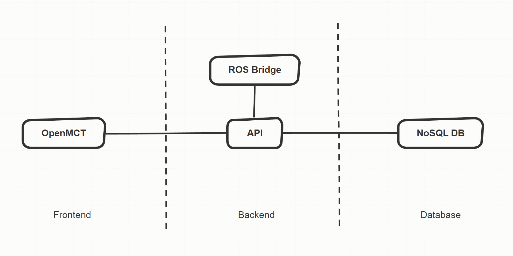

# NASA ISAAC User Interface

[](https://github.com/nasa/isaac_user_interface/blob/master/LICENSE)

### The NASA ISAAC UI is a full-fledged web-based user interface system for ROS projects. It provides a pre-configured frontend, backend, and database that allow monitoring and control of robots built using ROS.

---


---

## Quick Start

   Clone the ISAAC UI repository:

   `git clone https://github.com/nasa/isaac_user_interface.git`

   Build the ISAAC UI:

   `./build.sh`

   Run the ISAAC UI:

   `./run.sh`

   Check the status of the ISAAC UI:

   `./status.sh`

   Shutdown the ISAAC UI:

   `./shutdown.sh`

---

## Prerequisites

To build and run the ISAAC UI you must have installed:

- [Docker](https://docs.docker.com/engine/install/)
- [Docker Compose](https://docs.docker.com/compose/install/)
- [ROS Melodic](http://wiki.ros.org/melodic/Installation) or [ROS Noetic](http://wiki.ros.org/noetic/Installation)

You might already have the prerequisites installed. Verify this:

```bash
   docker --version
   docker-compose --version
   rosversion ros
```

Clone the ISAAC UI repository locally:

```
   git clone https://github.com/nasa/isaac_user_interface.git
   cd isaac_user_interface
```

The ISAAC UI assumes you have a ROS master node, but will run a master node for you should that not be the case.

```bash
   ./build.sh  # this may take 5 - 10 minutes

   ./run.sh  # now the UI is running at http://localhost:8080

   ./status.sh  # check the status of each subsystem

   ./shutdown.sh  # shutdown the UI 
```

---

## Architecture



---

## Usage with ISAAC

This user interface was built to support the Integrated System for Autonomous and Adaptive Caretaking (ISAAC) project, which is available [here](https://github.com/nasa/isaac). Installation instructions for the ISAAC simulation are available [here](https://github.com/nasa/isaac/blob/master/INSTALL.md). Once the simulation has been built, the easiest way to launch the ISAAC UI linked to the ISAAC simulation is by following the steps below.

```bash
# move to the ISAAC workspace defined in the installation steps
cd $ISAAC_WS

# clone this repository inside the workspace directory
git clone https://github.com/nasa/isaac_user_interface.git

# source the ISAAC simulation setup.bash file
source ./devel/setup.bash

# unset $ROS_MASTER_URI so ISAAC UI launches its own ROS Master node
unset ROS_MASTER_URI

# enter the ISAAC UI repository root directory
cd isaac_user_interface

# build and run the ISAAC UI
./build.sh --isaac && ./run.sh --isaac

# start ISAAC simulation and connect to ROS Master node
roslaunch isaac sim.launch --wait

# the ISAAC UI is now available at http://localhost:8080
```

## Debugging

If you get a permissions error when running a Docker script, you can either:

1. Run the scripts (.sh files) as root (preprend sudo to each command); OR
2. Add your linux user to the docker user group:

```
   sudo usermod -aG docker $USER
   newgrp docker
```

Read more about Docker's post installation steps [here](https://docs.docker.com/engine/install/linux-postinstall/).

---

## Contributors

https://github.com/nasa/isaac_user_interface/graphs/contributors

## License

Copyright (c) 2021, United States Government, as represented by the Administrator of the National Aeronautics and Space Administration. All rights reserved.

The "ISAAC - Integrated System for Autonomous and Adaptive Caretaking platform" software is licensed under the Apache License, Version 2.0 "License"); you may not use this file except in compliance with the License. You may obtain a copy of the License at http://www.apache.org/licenses/LICENSE-2.0.

Unless required by applicable law or agreed to in writing, software distributed under the License is distributed on an "AS IS" BASIS, WITHOUT WARRANTIES OR CONDITIONS OF ANY KIND, either express or implied. See the License for the specific language governing permissions and limitations under the License.